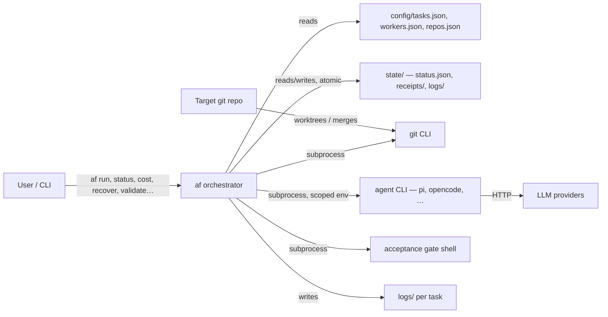
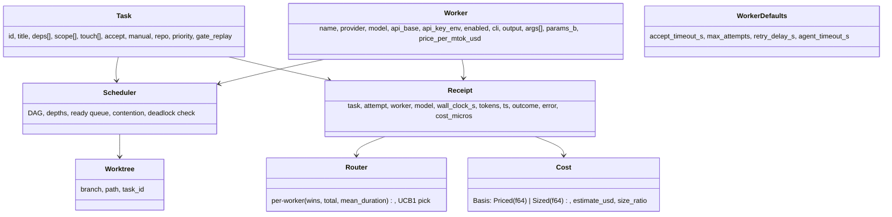

# 3. Context and Scope

## 3.1 System Context

## 3.2 Business / Black-Box Context

| Glossary term | Meaning in agentflow |
|---------------|----------------------|
| Task | Declarative unit: id, title, deps, scope, accept gate, repo target, priority, touch, gate_replay |
| Worker | One provider+model slot; at most one task at a time; carries a declared cost basis (`params_b` / `price_per_mtok_usd`) |
| Acceptance gate | Shell command run in the task's worktree; exit 0 = pass |
| Receipt | Record of one attempt: task, attempt, worker, model, wall-clock, tokens, cost_micros, outcome, error |
| Archived branch | `<branch>-rejected-[<attempt>-]<ts>[-<n>]` — a failed attempt's committed work, kept for recovery |
| Recovery | `af recover --task ID [--attempt N]` re-validates an archived branch (scope + gate) and merges it without re-invoking the agent |

The system gives the user a *trusted parallel executor*: it guarantees that
only gate-passing work lands on the base branch, that dependencies are
respected, that failed attempts are retried safely (fresh branch), that the
agent's committed work is never destroyed (archived on every failure path),
and that an over-narrow scope costs one re-validation instead of a re-run
(`af recover` or auto-reuse).

## 3.3 Scope

**In (v1, shipped):**
- Parallel dispatch (up to N workers, UCB1 routing from receipt history)
- Isolated git worktrees (one per attempt, fresh branch)
- Exact acceptance gates (exit 0 = pass, scoped env, timeout, replay contract)
- Dependency DAG + critical-path priority + deadlock detection
- Scope checking: advisory + enforced (`touch` validation, scope-violation detection, contention avoidance)
- Retry with fresh branch + optional backoff (`retry_delay_s`)
- Work preservation on EVERY failure path (archive as `<branch>-rejected-[<attempt>-]<ts>`)
- Recovery (`af recover --task ID [--attempt N]` + auto-reuse on `af run`)
- Honest success (dirty worktree committed, zero-commits-ahead = failure, merge verified)
- Interrupted-attempt tracking (killed orchestrator → `interrupted` receipt, not a verdict)
- Stall watchdog (`TF_AGENT_STALL_S`) and wall-clock budget cap (`TF_MAX_WALL_CLOCK_S`)
- Token + cost capture (JSON-mode transcript, provider-reported `cost_micros`, declared-basis estimates)
- Multi-repo (`repos.json`, per-task `repo`)
- Sandbox (env allowlist + git hygiene + opt-in wrapper seam)
- Status board (`af status [--json]`), live attach, per-task logs, `af cost` (waste/recovery ledger)
- `af validate` (config pre-flight), `af clean [--dry-run]` (orphan sweep), `af recover`

**Out (v1, documented as future):**
- Multi-repo transactional merges → `docs/multi-repo-design.md` (v2)
- Agent/governance extras → `docs/moe-sovereign-ideas.md` (bayes routing, episodic memory, trust, constitution, corrections, transparency, vLLM worker) (v2)
- Direct LLM API integration (deliberately out; ADR-1)
- Real-currency cost for providers other than the stub (`cost.total` = 0 for every real provider tested — a provider limitation, not an agentflow bug)

## 3.4 Domain Model (essential)

