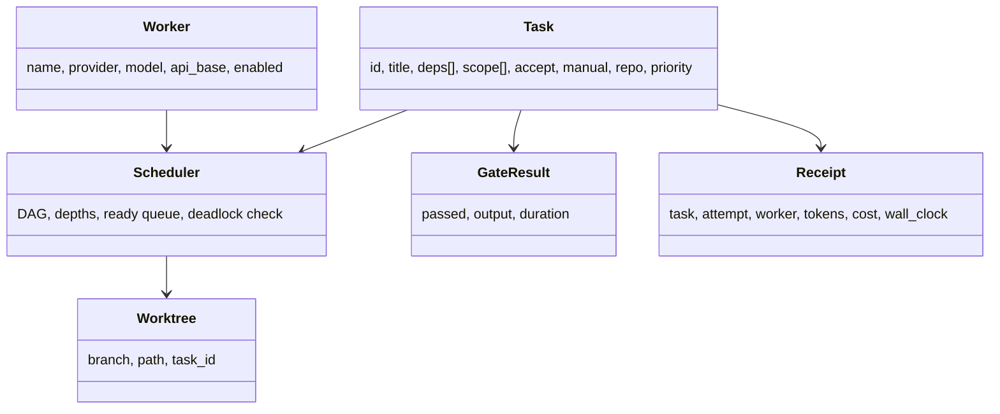

# 3. Context and Scope

## 3.1 System Context

```mermaid
flowchart LR
  U[User / CLI] -->|af run, status, api…| AF
  AF[af orchestrator]
  AF -->|reads| C[config/tasks.json, config/workers.json]
  AF -->|reads/writes, atomic| S[state/ state.json, receipts]
  AF -->|subprocess| G[git CLI]
  AF -->|subprocess| A[agent CLI (pi etc.)]
  A -->|HTTP| P[LLM providers]
  AF -->|subprocess| GATE[acceptance gate shell]
  AF -->|writes| L[logs/]

  R[Target git repo] -->|worktrees / merges| G
```

## 3.2 Business / Black-Box Context

| Glossary term | Meaning in agentflow |
|---------------|----------------------|
| Task | Declarative unit: id, title, deps, scope, accept gate, repo target |
| Worker | One provider+model slot; at most one task at a time |
| Acceptance gate | Shell command run in the task's worktree; exit 0 = pass |
| Receipt | Cost/energy record of one task attempt |

The system gives the user a *trusted parallel executor*: it guarantees that
only gate-passing work lands on the base branch, that dependencies are
respected, and that failed attempts are retried safely (fresh branch) rather
than corrupting shared state.

## 3.3 Scope

**In (v1):** parallel dispatch, worktrees, gates, retry, dependency DAG +
priority + deadlock detection, scope checking, contention avoidance (overlapping
scope not dispatched concurrently), status board, logs, cost receipts, config
compat, per-task repo target **single-repo mode**.

**Out (v1, documented as future):**
- Multi-repo targets → `docs/multi-repo-design.md` (v2)
- Agent/governance extras → `docs/moe-sovereign-ideas.md` (bayes routing, episodic
  memory, trust, constitution, corrections, transparency, vLLM worker) (v2)
- Direct LLM API integration (deliberately out; ADR-1)

## 3.4 Domain Model (essential)


