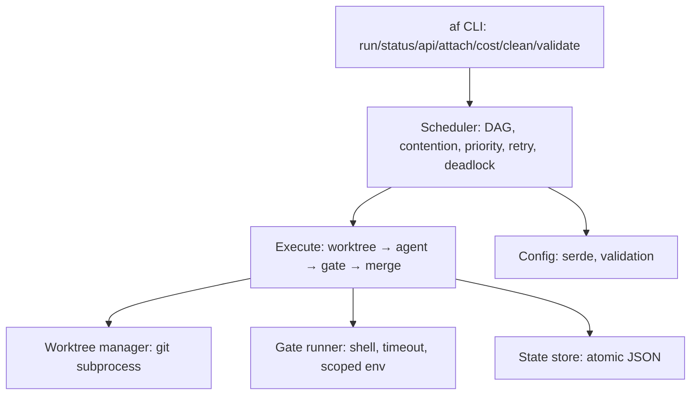

# 4. Solution Strategy

## 4.1 Where this comes from

agentflow is a clean-room reimplementation in Rust of organic bash orchestrator
logic that has proven itself across two evolved forks (taskfleet = internal,
agentflow-shell = experimental). Those codebases taught us the semantics that
must survive; they also taught us what "sound" means *not*: global mutable shell
state, string-parsed JSON, cross-process flocking, and untyped coupling between
scheduler/status/worktree/dispatch.

## 4.2 Strategy principles

1. **Thin orchestrator.** `af` does *not* talk to LLMs and does *not* wrap git
   in a library. It drives `git` and an OpenAI-compatible agent CLI as
   subprocesses (ADR-1). This keeps the crate small (~2–3k LOC), vendor-neutral,
   and easy to audit.
2. **One process, one writer.** Concurrency lives inside one tokio runtime;
   state is persisted as atomic JSON by a single writer (ADR-2, ADR-3). No
   cross-process locks, no corrupted-JSON recovery paths — a class of bugs the
   bash version spent its chaos tests on disappears.
3. **Strict module boundaries.** `core/` modules depend only downward
   (`main` → `scheduler` → `execute` → `worktree`/`gate`/`state`); `config`,
   `task`, `worker` are pure data + validation. Every module is unit-testable
   without the rest.
4. **Spec → contract → test pyramid** (ADR-5) is the *development* strategy —
   the same discipline the product enforces on agents (gates) is enforced on
   the product (contract tests), documented in 10.
5. **Compatibility over invention.** Config schemas match the shipped taskfleet
   examples, so real campaign configs are the integration corpus. Behavior is
   ported, then improved, not redesigned blind.
6. **Documentation as deliverable.** arc42, one file per chapter (ADR-7),
   maintained in the same PR as the code it describes.

## 4.3 Reference architecture

