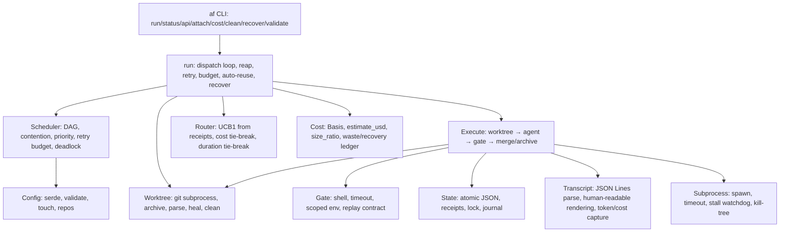

# 4. Solution Strategy

## 4.1 Where this comes from

agentflow is a clean-room reimplementation in Rust of organic bash orchestrator
logic that has proven itself across two evolved forks (taskfleet = internal,
agentflow-shell = experimental). Those codebases taught us the semantics that
must survive; they also taught us what "sound" means *not*: global mutable shell
state, string-parsed JSON, cross-process flocking, and untyped coupling between
scheduler/status/worktree/dispatch.

14 rounds of dogfooding (agentflow dispatching tasks that improve agentflow)
have hardened every feature: each round spec'd the change, wrote tests, ran a
real campaign against real LLM agents, probed the result against a pre-change
binary, and documented the outcome. The current state is 167 commits, 340
tests, 96.83% line coverage, 7 OpenSpec specs (43 requirements, 148 scenarios).

## 4.2 Strategy principles

1. **Thin orchestrator.** `af` does *not* talk to LLMs and does *not* wrap git
   in a library. It drives `git` and an OpenAI-compatible agent CLI as
   subprocesses (ADR-1). This keeps the crate small (~10k LOC, zero runtime
   deps beyond std + serde), vendor-neutral, and easy to audit.
2. **One process, one writer.** Concurrency lives inside std
   `thread::scope` per-attempt threads; state is persisted as atomic JSON by a
   single writer (ADR-2, ADR-3). No cross-process locks, no corrupted-JSON
   recovery paths — a class of bugs the bash version spent its chaos tests on
   disappears. A lock file (`state/state.lock`) prevents two `af` processes
   from sharing one state dir.
3. **Strict module boundaries.** `run` → `execute` → `worktree` / `gate` /
   `state`; `config`, `cost`, `router`, `scheduler`, `transcript` are pure
   data + logic. Every module is unit-testable without the rest.
4. **Spec → contract → test pyramid** (ADR-5) is the *development* strategy —
   the same discipline the product enforces on agents (gates) is enforced on
   the product (contract tests), documented in 10.
5. **Compatibility over invention.** Config schemas match the shipped taskfleet
   examples, so real campaign configs are the integration corpus. Behavior is
   ported, then improved, not redesigned blind.
6. **Documentation as deliverable.** arc42, one file per chapter (ADR-7),
   maintained in the same PR as the code it describes.
7. **Declared beats inferred.** Config fields are explicit; the harness does
   not sniff CLI args or model names for magic behaviour, and does not mine
   human-authored prose for intent (round 12: 59% false-positive rate killed
   the prose-mining design). A `touch` field is a declaration; a cost basis is
   a declaration; a `gate_replay` flag is a declaration.
8. **Honest success.** `Merged` means the base really contains the work —
   never inferred from an exit code (round 13). A dirty worktree is committed
   before judging; zero commits ahead is a failure; the branch tip is verified
   in the base.
9. **Work is never destroyed.** Every failure path archives the branch as
   `<branch>-rejected-[<attempt>-]<ts>` (rounds 11–14). `af recover` and
   auto-reuse re-validate and merge archived work without re-invoking the agent.

## 4.3 Reference architecture

## 4.4 Feature evolution (14 dogfooding rounds)

| Round | Theme | Key outcome |
|-------|-------|-------------|
| 1–2 | baseline + config injection | 5+4 tasks, `{{ACCEPT_CMD}}` injection, `af clean`, `af status --json`, `af validate` |
| 3 | durability contracts | lock file, atomic receipts, stall watchdog, spec reconciliation |
| 4 | traceability | spec↔test traceability checker proven non-vacuous |
| 5 | coverage ratchet | 94% line-coverage floor, raise-only |
| 6 | `--last`/`--since` | windowed cost reports |
| 7 | cost-efficiency | poll wake-up, stall watchdog, atomic receipts, budget cap, spec reconciliation |
| 8 | cost leaks | poll wake-up (60s→4.5s), stall watchdog (25.9s→3.3s), atomic receipts, budget cap |
| 9 | telemetry | JSON-mode token capture, retry pacing, priority spec, interrupted tracking, ledger truth, worker args, renderer |
| 10 | cost model | `Basis { Priced, Sized }`, declared cost, router cost tie-break, measured cost outranks declared |
| 11 | attempt identity + rejected work | interrupted receipt, duration tie-break, archive on scope/merge-conflict, `af cost` measured cost |
| 12 | touch/clean/recover | `touch` validation, `af clean` prunes archives, `af recover --task ID` |
| 13 | work integrity + auto-recover | dirty worktree committed, zero-commits = failure, merge verified, archive on ALL failure paths, auto-reuse |
| 14 | recovery ledger | archive name encodes attempt, `recovered` receipt, `af cost` RECOVERED line, `--attempt N` flag |
