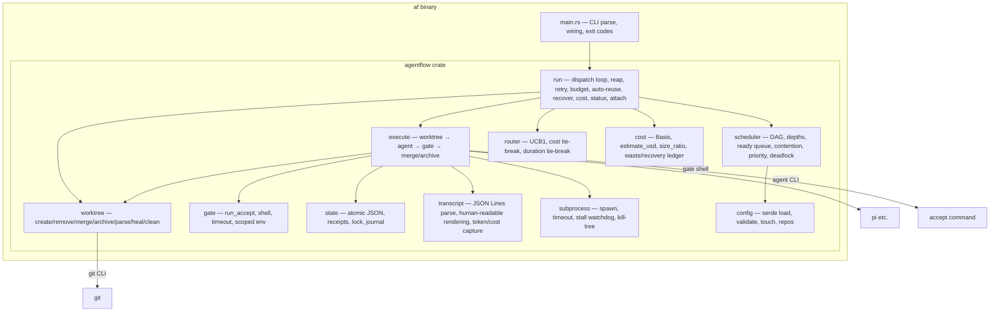

# 5. Building Block View

## 5.1 Whitebox Overall

## 5.2 Module responsibilities and dependencies

| Module | LOC | Responsibility | Depends on | Depended on by |
|--------|-----|----------------|-----------|----------------|
| `main.rs` | 404 | Parse args (`run/status/api/attach/cost/clean/recover/validate`), load config, wire runtime, exit codes | All | — |
| `config` | 909 | Load/validate `tasks.json`, `workers.json`, `repos.json`; `Task`, `Worker`, `WorkerDefaults`, `Settings`; `touch` validation; cycle detection | serde, `scheduler::scope_overlap` | `run`, `main` |
| `scheduler` | 575 | DAG build + depths, ready queue (deps, contention, priority, retry budget), deadlock detection — pure functions, no I/O | `config` | `run` |
| `router` | 316 | UCB1 worker selection from receipts; cost tie-break (declared basis); duration tie-break (measured mean) | `state` | `run` |
| `execute` | 1194 | Task lifecycle: worktree create → prompt render → spawn agent → gate → merge/archive; attempt/retry loop; dirty-commit; scope check; preserve_work on every failure path | `worktree`, `gate`, `state`, `subprocess`, `transcript`, `config`, `run` | `run` |
| `worktree` | 1028 | `git worktree add/remove`, branch delete, merge (serialized per repo), conflict detection, archive (`<branch>-rejected-[<attempt>-]<ts>`), parse archived name, heal stale, clean, commits_ahead, is_dirty, commit_all | git subprocess | `execute`, `run` |
| `gate` | 81 | Run `accept` shell with scoped env + timeout; exit-0 contract; replay contract (`TF_GATE_REPLAY`) | `subprocess` | `execute` |
| `state` | 601 | Read/update/append `state/` JSON atomically (single writer, lock file); receipts (with `outcome`, `cost_micros`); `counts_as_verdict()`; `TaskStatus`, `AttemptPhase` | serde | `run`, `execute`, `router`, `cost` |
| `subprocess` | 545 | Spawn → optional streaming tail → wait with timeout → stall watchdog → kill-tree; `CmdKind` (Success/NonZero/Timeout/Stalled/Missing); `EnvMode` (trusted/sandbox) | std | `execute`, `gate` |
| `transcript` | 717 | Parse JSON Lines agent transcript → human-readable log; extract `totalTokens` + `cost.total` (micro-USD); `Usage` struct | serde_json | `execute` |
| `cost` | 218 | `Basis { Priced(f64), Sized(f64) }`; `estimate_usd`; `size_ratio`; cost-basis comparison; expense classification | `state`, `config` | `run` |
| `run` | 3349 | Dispatch loop, reap, retry, budget cap, auto-reuse, `af recover`, `af cost`, `af status`, `af attach`, `af api`, heal stale, `branch_merged_into_head`, `CostFilter` | All | `main` |

## 5.3 Dependency rules (enforced in review / CI)

- Acyclic: `config`/`scheduler`/`router`/`cost`/`transcript`/`gate`/`subprocess`/`state` import **no** other core module (pure data + logic); `execute` imports `worktree`/`gate`/`state`/`subprocess`/`transcript`; `run` imports everything.
- `state` has no core dependencies (I/O only).
- No module spawns non-child processes other than `git` / agent / gate subprocesses.
- Public functions carry **contract tests** (see 10) — total functions, defined
  exit/error contracts, no panics across module boundary except documented ones.
- `pub(crate)` is used for helpers shared between `run` and `execute` (`changed_paths`, `scope_violations`, `branch_merged_into_head`) — these are NOT public API.
