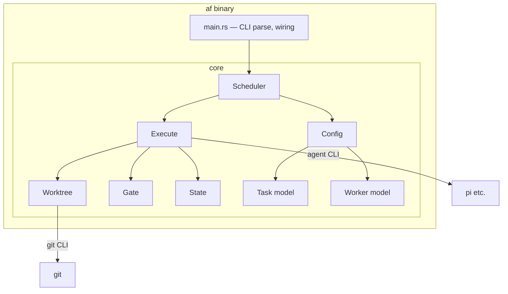

# 5. Building Block View

## 5.1 Whitebox Overall

## 5.2 Module responsibilities and dependencies

| Module | Responsibility | Depends on | Depended on by |
|--------|----------------|-----------|----------------|
| `main.rs` | Parse args (`run/status/api/attach/cost`), load config, wire runtime | All | — |
| `core::config` | Load/validate `tasks.json`, `workers.json`, `repos` (v2); derive defaults | serde | `scheduler`, `main` |
| `core::task` | Task/Worker structs, state enum, `deps`/`scope`/`accept` fields, pure validation | — | `config`, `scheduler`, `execute` |
| `core::worker` | Worker (provider/model/api_base) registry, enabled filtering | — | `scheduler` |
| `core::scheduler` | DAG build + depths, ready queue, contention (overlapping scope), priority, retry budget, deadlock detection | `task`, `worker`, `state` | `main` |
| `core::execute` | Task lifecycle: worktree create → prompt render → spawn agent → tail log → gate → merge; attempt/retry loop | `worktree`, `gate`, `state` | `scheduler` |
| `core::worktree` | `git worktree add/remove`, branch delete, merge (serialize per repo), conflict detection | git subprocess | `execute` |
| `core::gate` | Run `accept` shell with scoped env + timeout; capture output; exit-0 contract | — | `execute` |
| `core::state` | Read/update/append `state/` JSON atomically (single writer); receipts | serde | `scheduler`, `execute` |

## 5.3 Dependency rules (enforced in review / CI)

- Acyclic: layout follows the table; `config/task/worker` import **no** other
  core modules (pure data).
- `state` has no core dependencies (I/O only).
- No module spawns non-child processes other than `git` / agent / gate subprocesses.
- Public functions carry **contract tests** (see 10) — total functions, defined
  exit/error contracts, no panics across module boundary except documented ones.
