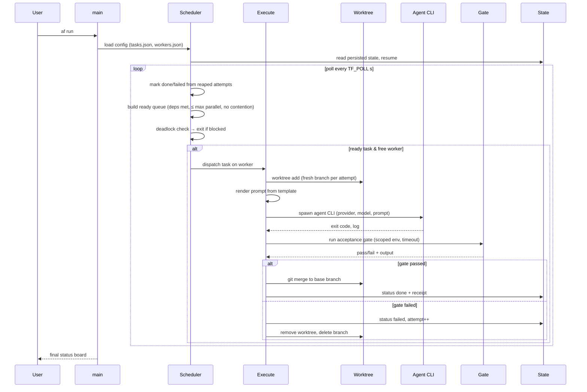

# 6. Runtime View

## 6.1 Main scenario: `af run`

## 6.2 Crash / resume scenario

- `state/` is updated **before** each visible transition — an attempt that is
  spawned but not yet recorded cannot lose work; a merge is recorded only after
  git confirms it.
- If `af` is killed: completed merges are discovered on restart by re-scanning
  worktrees / git branches and persisted state; orphan worktrees from a dead
  attempt are cleaned at startup (self-heal). State JSON is written
  atomically (temp file + rename), so a torn kill never leaves corrupt JSON.

## 6.3 Retry scenario

- On gate failure, scheduler increments attempt counter; if `attempt < max_attempts`
  the task is re-queued. Each retry gets a **fresh branch + fresh worktree**
  (never reuses dirty state). Release of the worker slot and re-queue obey the
  same contention/priority rules as first dispatch.

## 6.4 Concurrency model

- One tokio runtime; tasks execute as concurrent tasks; git/agent/gate run as
  subprocesses awaited with timeouts and kill-trees (no zombies).
- The **single writer** guarantees serialized state transitions; reads during
  dispatch are lock-free snapshots.
