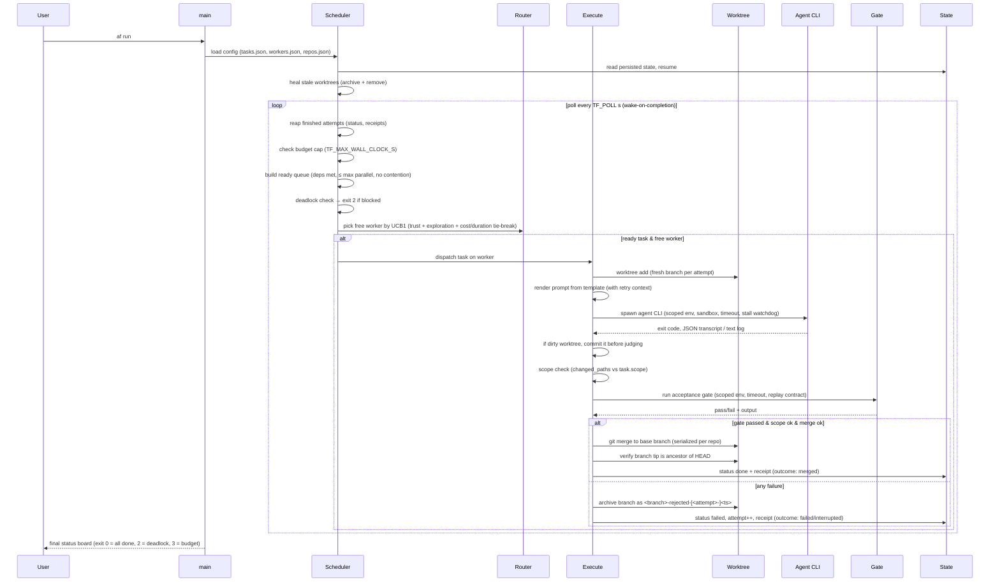

# 6. Runtime View

## 6.1 Main scenario: `af run`

## 6.2 Auto-reuse (round 13)

Before dispatching an agent for a task, `af run` looks for an archived branch
of that task whose changed paths already satisfy the task's CURRENT `scope`.
When one qualifies, it re-runs the gate on that branch and merges it — printing
`↺ <id> reused archived branch <name>` — without invoking an agent at all. A
reuse is NOT an attempt (no receipt, no worker, no cost). `TF_NO_REUSE=1`
disables it. The gate stays the sole arbiter of what merges, so reuse can only
ever save money.

## 6.3 Crash / resume scenario

- `state/` is updated **before** each visible transition — an attempt that is
  spawned but not yet recorded cannot lose work; a merge is recorded only after
  git confirms it.
- If `af` is killed: the attempt is recorded as `interrupted` (outcome, not a
  verdict) with the worker and an upper-bound duration. On restart,
  `heal_stale_attempt` archives the stale worktree's branch (preserving the
  work) and removes the worktree. State JSON is written atomically (temp +
  fsync + rename), so a torn kill never leaves corrupt JSON — a torn write is
  reported by name, never silently empty.
- A lock file (`state/state.lock`, pid-recorded) prevents two `af` processes
  from sharing one state dir; a dead pid is accepted (stale lock does not block).

## 6.4 Retry scenario

- On gate failure, scheduler increments attempt counter; if `attempt < max_attempts`
  the task is re-queued. Each retry gets a **fresh branch + fresh worktree**
  (never reuses dirty state). Release of the worker slot and re-queue obey the
  same contention/priority rules as first dispatch.
- `retry_delay_s` (default 0, opt-in) paces retries of the SAME task: after a
  failed attempt that will be retried, the task waits this many seconds before
  its next attempt starts. The wait rides the retry path only — first attempts,
  first-try merges, and other workers' dispatches are never delayed.
- Retry prompts (attempt ≥ 2) render the task's earlier failures so the agent
  avoids repeating them (ADR-13).

## 6.5 Recovery scenario (`af recover`)

- `af recover --task ID [--attempt N] [--dry-run]` selects the newest archived
  branch (`<branch>-rejected-[<attempt>-]<ts>`) for the task, re-checks scope,
  re-runs the gate, and merges on success — **without re-invoking the agent**.
- `--attempt N` restricts to archives whose parsed attempt == N; without the
  flag, newest-by-ts is selected. Legacy 3-field archives (no attempt) parse as
  attempt 0.
- Exit 0 = recovered; exit 2 = nothing to recover / unknown task / no archive
  for the requested attempt; exit 1 = still fails its re-check (branch kept).
- A `recovered` receipt (outcome `"recovered"`, `wall_clock_s: 0.0`) is
  appended; `af cost` pairs it with the original failed receipt and shows a
  `RECOVERED:` line, excluding the salvaged failed receipt from `WASTED`.
- The failed attempt's receipt is never rewritten — history is append-only.

## 6.6 Concurrency model

- One process; per-attempt threads via `std::thread::scope`; git/agent/gate run
  as subprocesses awaited with timeouts and kill-trees (no zombies).
- The **single writer** guarantees serialized state transitions; reads during
  dispatch are lock-free snapshots.
- Merges are serialized per repository (single `MergeLocks` map in-process).
- Contention: tasks whose `scope` globs overlap are not dispatched concurrently.
