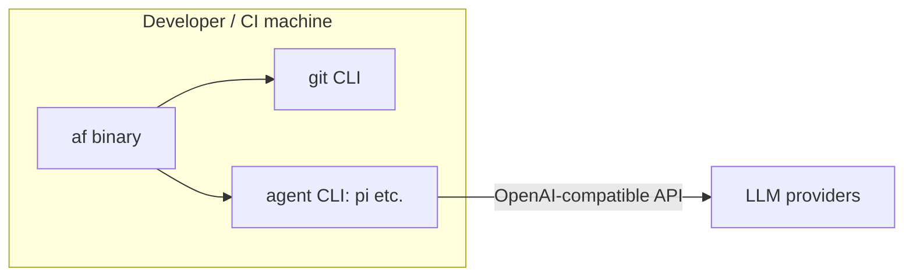

# 7. Deployment View

## 7.1 Topology

## 7.2 Deployment details

| Item | Detail |
|------|--------|
| Artifact | Cargo crate `agentflow` → single static binary `af` (also published to crates.io) |
| Host | Linux, macOS, Windows (WSL). CI: GitHub Actions (Ubuntu) |
| Preconditions | `git` on PATH; an OpenAI-compatible agent CLI on PATH; network to LLM providers |
| Data | `config/` input JSON; `state/` (status.json, receipts/, logs/) as the only writable runtime dir |
| Env vars | `TF_DIR`, `TF_REPO_DIR`, `TF_STATE_DIR`, `TF_BRANCH_PREFIX`, `TF_POLL`, `TF_MAX_PARALLEL`, `TF_GATE_ENV`, `TF_LIB_DIR` (kept for drop-in compat) |
| Two modes | Interactive local; CI front-end (status board as machine-readable JSON) |

## 7.3 Security at the boundary (deployment)

- The public repo contains **no** secrets, hosts, or internal campaign data
  (ADR-8); `workers.json.example` exists, real `workers.json` is git-ignored.
- Gate/agent subprocesses run with scoped env (only declared vars passed via
  `TF_GATE_ENV`), capturing only stdout/stderr into per-task logs.
- Gates run in the task's worktree dir, not the base repo, so a malicious task
  cannot mutate live state during operation.
