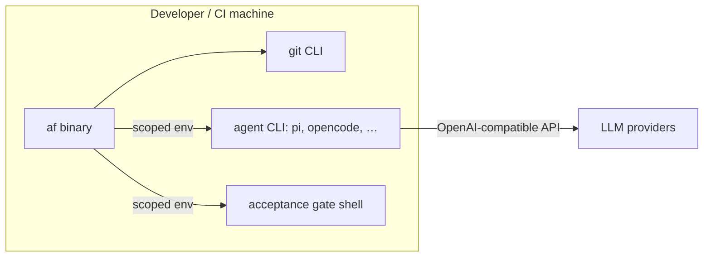

# 7. Deployment View

## 7.1 Topology



## 7.2 Deployment details

| Item | Detail |
|------|--------|
| Artifact | Cargo crate `agentflow` → single static binary `af` (also published to crates.io) |
| Host | Linux, macOS, Windows (WSL). CI: GitHub Actions (Ubuntu) |
| Preconditions | `git` on PATH; an OpenAI-compatible agent CLI on PATH; network to LLM providers |
| Data | `config/` input JSON; `state/` (status.json, receipts/, logs/, worktrees/) as the only writable runtime dir |
| Env vars | `TF_REPO_DIR`, `TF_STATE_DIR`, `TF_MAX_PARALLEL`, `TF_BRANCH_PREFIX`, `TF_POLL`, `TF_GATE_ENV`, `TF_TASKS_JSON`, `TF_WORKERS_JSON`, `TF_REPOS_JSON`, `TF_AGENT_TIMEOUT_S`, `TF_AGENT_STALL_S`, `TF_MAX_WALL_CLOCK_S`, `TF_SANDBOX_CMD`, `TF_AGENT_ENV_PASSTHROUGH`, `TF_NO_REUSE`, `TF_WORKTREE_ROOT` |
| Two modes | Interactive local; CI front-end (status board as machine-readable JSON) |

## 7.3 Security at the boundary (deployment)

- The public repo contains **no** secrets, hosts, or internal campaign data
  (ADR-8); `workers.json` is git-ignored, `workers.json.example` exists.
- Gate/agent subprocesses run with scoped env (only declared vars passed via
  `TF_GATE_ENV` / `TF_AGENT_ENV_PASSTHROUGH`), capturing only stdout/stderr
  into per-task logs.
- Gates run in the task's worktree dir, not the base repo, so a malicious task
  cannot mutate live state during operation.
- The agent child gets an **empty environment** plus system basics, the
  dispatched worker's `api_key_env`, and `TF_AGENT_ENV_PASSTHROUGH`; other
  workers' keys and orchestrator secrets are withheld (ADR-10).

## 7.4 CLI commands

```
af run       [--once] [--dry-run] [--worker NAME] [--task ID] [--poll SECS] [--tasks FILE] [--workers FILE] [--repos FILE]
af status    [--json]
af api       status [--json] | results --task ID
af attach    ID
af cost      [--task ID] [--last] [--since DATE|UNIX_TS]
af clean     [--dry-run]
af recover   --task ID [--attempt N] [--dry-run]
af validate  [--worker NAME] [--tasks FILE] [--workers FILE]
af --help | --version
```

### Exit codes

| Code | Meaning |
|------|---------|
| `0` | Done — every in-scope task reached `done` (or `--dry-run`/`--once` finished its work) |
| `1` | `recover`: the archived work still fails its re-check (branch kept) |
| `2` | Configuration error, unknown flag/command, or **deadlock** (no task can make progress), or `recover`: nothing to recover / unknown task / no archive for the requested `--attempt` |
| `3` | Stopped early — the wall-clock budget was exhausted before every in-scope task could be started |
