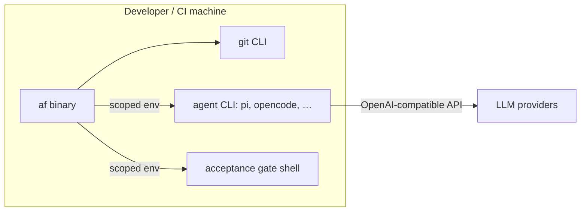

# 7. Deployment View

## 7.1 Topology



## 7.2 Deployment details

| Item | Detail |
|------|--------|
| Artifact | Cargo crate `agentflow` → single binary `af` (also published to crates.io). Packaging/distribution: nix flake (`flake.nix`) → package, static binary, container image (§7.5) |
| Host | Linux, macOS, Windows (WSL). CI: GitHub Actions (Ubuntu) |
| Preconditions | `git` on PATH; an OpenAI-compatible agent CLI on PATH; network to LLM providers |
| Data | `config/` input JSON; `state/` (status.json, receipts/, logs/, worktrees/) as the only writable runtime dir |
| Env vars | `TF_REPO_DIR`, `TF_STATE_DIR`, `TF_MAX_PARALLEL`, `TF_BRANCH_PREFIX`, `TF_POLL`, `TF_GATE_ENV`, `TF_TASKS_JSON`, `TF_WORKERS_JSON`, `TF_REPOS_JSON`, `TF_AGENT_TIMEOUT_S`, `TF_AGENT_STALL_S`, `TF_MAX_WALL_CLOCK_S`, `TF_SANDBOX_CMD`, `TF_AGENT_ENV_PASSTHROUGH`, `TF_NO_REUSE`, `TF_WORKTREE_ROOT` |
| Two modes | Interactive local; CI front-end (status board as machine-readable JSON) |

## 7.3 Security at the boundary (deployment)

- The public repo contains **no** secrets, hosts, or internal campaign data
  (ADR-8); `workers.json` is git-ignored, `workers.json.example` exists.
- Gate/agent subprocesses run with scoped env (only declared vars passed via
  `TF_GATE_ENV` / `TF_AGENT_ENV_PASSTHROUGH`), capturing only stdout/stderr
  into per-task logs.
- Gates run in the task's worktree dir, not the base repo, so a malicious task
  cannot mutate live state during operation.
- The agent child gets an **empty environment** plus system basics, the
  dispatched worker's `api_key_env`, and `TF_AGENT_ENV_PASSTHROUGH`; other
  workers' keys and orchestrator secrets are withheld (ADR-10).

## 7.4 CLI commands

```
af run       [--once] [--dry-run] [--worker NAME] [--task ID] [--poll SECS] [--tasks FILE] [--workers FILE] [--repos FILE]
af status    [--json]
af api       status [--json] | results --task ID
af attach    ID
af cost      [--task ID] [--last] [--since DATE|UNIX_TS]
af clean     [--dry-run]
af recover   --task ID [--attempt N] [--dry-run]
af validate  [--worker NAME] [--tasks FILE] [--workers FILE]
af --help | --version
```

### Exit codes

| Code | Meaning |
|------|---------|
| `0` | Done — every in-scope task reached `done` (or `--dry-run`/`--once` finished its work) |
| `1` | `recover`: the archived work still fails its re-check (branch kept) |
| `2` | Configuration error, unknown flag/command, or **deadlock** (no task can make progress), or `recover`: nothing to recover / unknown task / no archive for the requested `--attempt` |
| `3` | Stopped early — the wall-clock budget was exhausted before every in-scope task could be started |

## 7.5 Packaging & artifacts (nix flake)

One `flake.nix` derives every artifact from the same tracked source and the
committed `Cargo.lock` (`cargoLock.lockFile` — no hash pinning); `flake.lock`
pins the nixpkgs channel, so the toolchain (cargo/rustc/gcc) is byte-stable
across machines. Declared for `x86_64-linux` and `aarch64-linux`.

| Output | Command | Result | What it is |
|--------|---------|--------|------------|
| `.#default` | `nix build .#default` | `result-af/bin/af` | glibc binary; prebuilt nixpkgs toolchain |
| `.#static` | `nix build .#static` | `result-af-static/bin/af` | **static-pie musl ELF** — no interpreter, no glibc floor; runs on any Linux |
| `.#image` | `nix build .#image` | `result-image` → `docker load` | campaign-runner image `agentflow:<ver>` (§7.7) |

Driver script `scripts/dist/nix-build.sh <default\|static\|image>` wraps the
nix invocation (PATH + experimental features) for environments where nix is
installed user-local (WSL). glibc builds without nix come from
`scripts/dist/build-x64.sh` (bookworm container, glibc ≥ 2.32 floor) and
`scripts/dist/build-arm64.sh` (native docker on an aarch64 host).

**Rejected alternative:** hand-rolled musl via `RUSTFLAGS="-C
target-feature=+crt-static -C link-arg=-static"` produces a binary that
compiles clean but **segfaults at runtime** (reproduced on two kernels).
`pkgsStatic` wires the same flags correctly — do not retry the hand-rolled
route. Similarly, `rust:1-slim` floats to the newest Debian (glibc 2.39
requirement); pin a bookworm base for portable glibc builds.

## 7.6 Fleet rollout

A private ansible playbook distributes the built artifacts to fleet hosts
(kept out of this public repo per ADR-8 — it references internal hosts):

- targets every reachable Linux host; per-host architecture selects
  `af-linux-x64` vs `af-linux-arm64`; installs to `/usr/local/bin/af` (0755).
- **glibc guard:** the bookworm-built binary needs glibc ≥ 2.32; hosts below
  that keep a **natively built** binary (rustup + `cargo build --release` on
  the host) and the playbook skips them with a note instead of clobbering a
  working install.
- the `.#static` output removes the glibc floor entirely — rolling static
  binaries to all hosts collapses the native-build special cases (planned).
- unreachable hosts (VPN-only laptops, sleeping machines) are skipped
  (`ignore_unreachable`) and picked up on the next run.

Two failure modes learned en route, both now encoded as guards: `set -o
pipefail` + `head` in an ansible `shell` task turns SIGPIPE into rc=141 on
hosts whose `ldd --version` prints multiple lines (use `awk 'NR==1'`), and a
"verified" rollout must run the binary (`af --version`) — a stale artifact in
the distribution directory can otherwise ship silently (this bit exactly
once: a broken musl binary overwrote good glibc ones across hosts).

## 7.7 Containerized running

`agentflow:<ver>` is a **campaign-runner** image, not a slim CLI shim — it
carries af plus the toolchain gates and agent tools need: `git`, `cargo`,
`rustc`, `gcc`, `bash`, `coreutils`, `gnugrep`, `gnused`, `findutils`,
`cacert` (`SSL_CERT_FILE` preset for rustls-native-certs).

- `ENTRYPOINT` is `af`, so everything after the image name is af arguments:
  `docker run agentflow:0.1.0 --version` works; toolchain shells use
  `--entrypoint bash`.
- Mount what a campaign touches: the target repo (rw — worktrees, branches,
  merges happen there) and the config directory. `TF_REPO_DIR` / `TF_STATE_DIR`
  point at the mounts; `run --dry-run` and `validate` need no state write
  access, real runs should mount the state dir too or it lives in the
  container layer and is lost on removal.
- Validated end-to-end: `af --version`, full toolchain present, and `af
  validate` on the real campaign config produces byte-identical output inside
  the container and on the host.

nix notes that cost an hour each, kept here as warnings: nix only reads
**git-tracked** files — `git add -N` new files before building; and do not
inline nix/docker commands through a Windows→WSL shell hop (path mangling),
use a script file.
