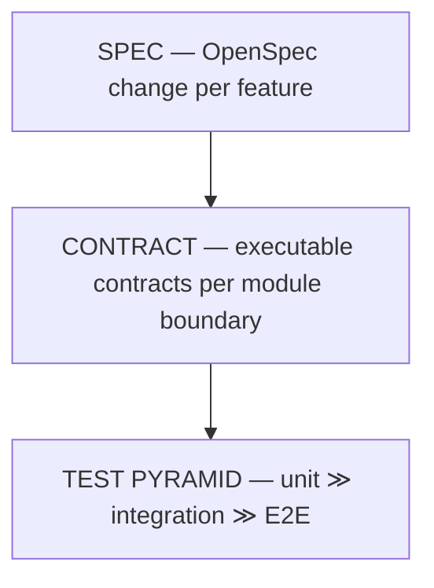

# 10. Quality Requirements

## 10.1 Quality scenarios (stimulus → response → measure)

| Req | Scenario | Measure / verification |
|-----|----------|------------------------|
| Reliability | Orchestrator killed between gate pass and merge | Restart resumes; no lost tasks, no double merge | 
| Reliability | Orchestrator killed mid-write of state JSON | Atomic temp+rename ⇒ no corrupt state; startup self-heals worktrees |
| Correctness | Agent returns junk exit code / empty work | Gate (exit-0 contract) prevents merge; status `failed` |
| Correctness | Two tasks touch overlapping scope files | Contention defers overlap; no simultaneous writes |
| Correctness | Circular / unsatisfiable deps | Deadlock detection exits cleanly, never hangs |
| Concurrency | N workers at max parallel with shared git repo | Serialized merges; deterministic state board |
| Performance | 100 tasks, 8 workers | dispatch overhead ≪ agent time; queues drain |
| Testability | Full run without any network or LLM | Fake agent CLI + scratch git repo ⇒ deterministic CI (ADR-5) |
| Security | Public repo scanned for credentials | No secrets in git history/HEAD (ADR-8); `workers.json` ignored |

## 10.2 The spec → contract → test pyramid (how quality is *produced*)

1. **Spec (top, few):** each feature is an OpenSpec change — stated behavior,
   delta requirements, design, tasks — reviewed before code. No "silent feature".
2. **Contract (middle):** for every public module function — totality (never
   panics), stable error/exit-code contracts, schema round-trips. Like the
   agent's acceptance gate, the *product's* contracts are executable and enforced
   in CI. If a contract test fails, the module boundary is wrong, not the test.
3. **Test pyramid (bottom, many):**
   - **Unit** (most): state machine transitions, DAG/deadlock logic, gate
     parsing, config validation, contention computation, receipt math.
   - **Integration** (some): worktree lifecycle against a scratch repo, full
     `execute` pipeline with a fake agent + real git, merge serialization.
   - **E2E** (fewest, CI-gated): `cargo test -- --ignored e2e` spins up a real
     agent CLI against a scratch repo (opt-in; no network dependency by default).

## 10.3 What is NOT required

- Porting the ~300 bash tests verbatim. We port *behavioral contracts* (which
  the bash suite proved) into the pyramid above, not test-for-test parity.
- Coverage thresholds as a gate in v1; contract + DAG coverage is the focus.
