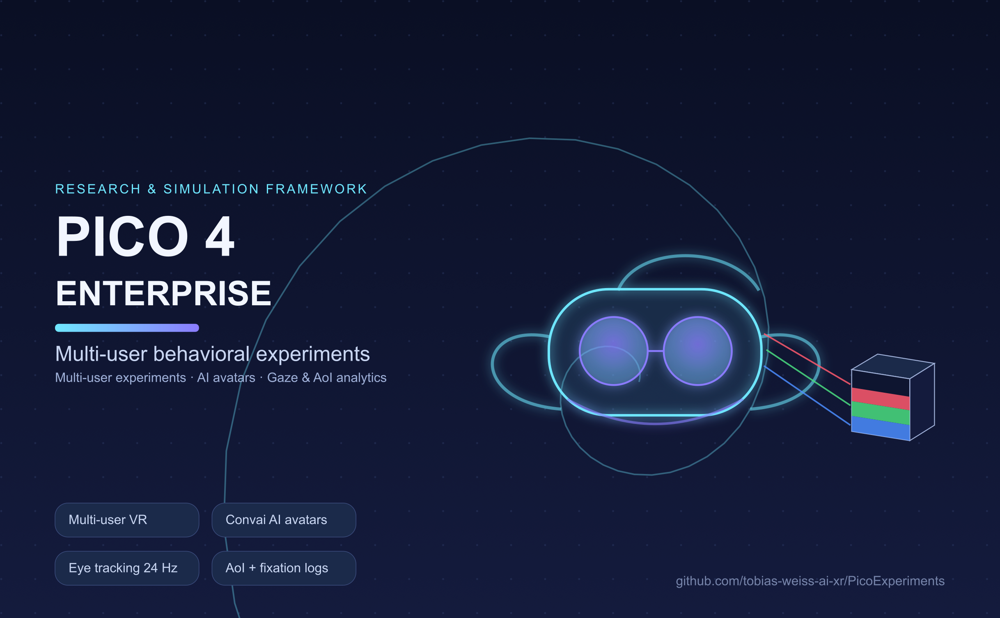
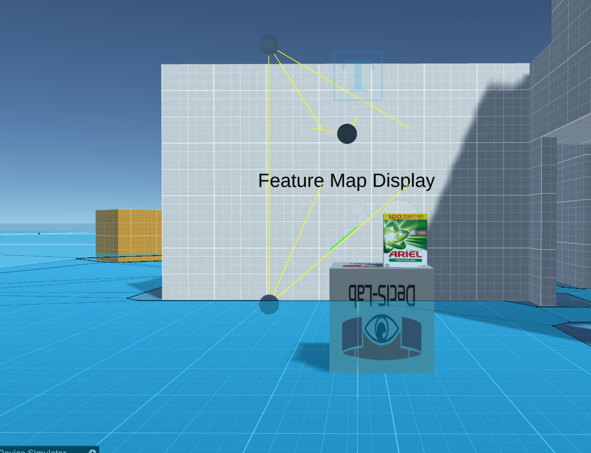
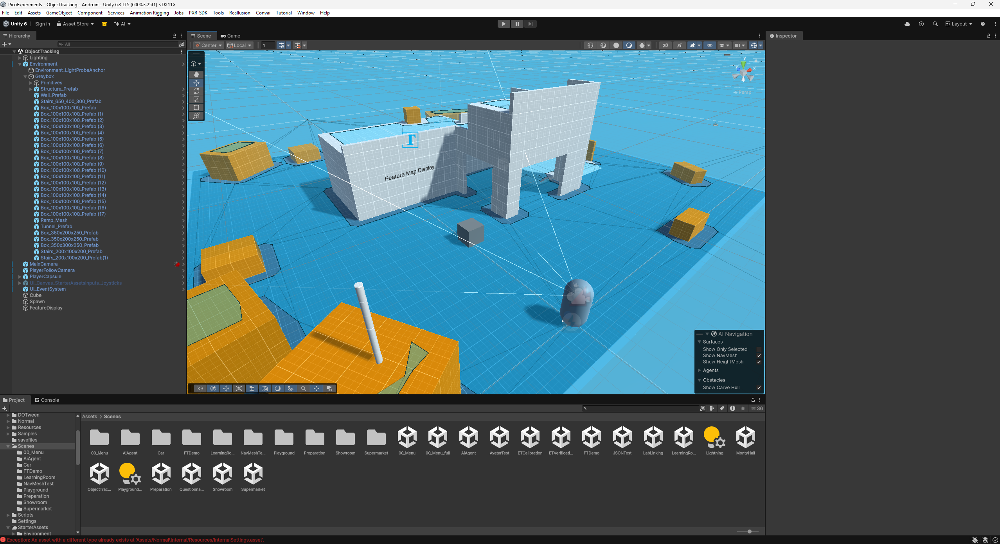
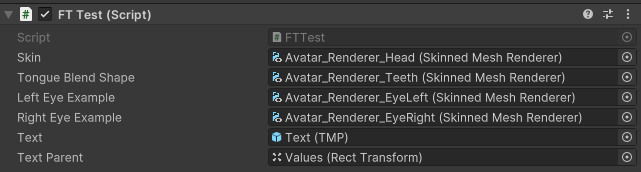

# PICO 4 Enterprise VR Research & Simulation Framework

A research and simulation framework for behavioral experiments on the PICO 4
Enterprise HMD: multi-user VR scenes, AI avatars, and integrated data logging
for gaze, areas of interest (AoIs), and user interaction.




## Requirements

| Component | Version / Notes |
|---|---|
| Unity | 6000.3.25f1, Android build target, URP |
| HMD | PICO 4 Enterprise (PICO Unity SDK); desktop testing without headset supported |
| Eye tracking | Built-in PICO eye tracking, optional (head-gaze fallback) |
| Normcore | App key required for multi-user scenes |
| Convai | API key required for AI avatar scenes |

## Quick start

1. Open the project in Unity, switch to the Android platform.
2. For a first look, open `Assets/Scenes/ObjectTracking.unity` and press Play —
   runs in the editor without a headset (StarterAssets first-person rig).
3. For the device, build the APK and deploy to the PICO 4 Enterprise.
4. After a session on device, pull the recordings:
   `python analysis/pull_device_recordings.py --list` and analyze with
   `python analysis/aoi_report.py`.

## Scenes

| Scene | Purpose |
|---|---|
| `00_Menu` | Main menu / lobby |
| `Supermarket` | Multi-user shopping environment with AI agent |
| `ObjectTracking` | Feature-map AoI tracking demo (see below) |
| Showroom (car) | Product presentation with switchable exhibits |
| Showroom (3D printer) | AI sales-avatar consultation |
| Monty Hall | Decision-making task |
| Questionnaire (immersive) | In-VR questionnaire |

## Framework capabilities

- **Multi-user VR** (Normcore): shared avatars, synchronized dashboards and shop
  interactions (checkout UI, doors, spawnable objects)
- **AI sales avatars** (Convai): speech-driven agents with face tracking and
  lip sync on device
- **Eye & face tracking on PICO**: 24 Hz combined eye gaze, fixation/saccade
  event detection, UDP streaming of gaze events to an external classifier
- **AoI tracking pipeline (`aoi-v4`)**: head-gaze or eye-gaze classification,
  dwell-debounced area switching, fixation logging, live attention heatmap —
  detailed below
- **Self-describing research data**: every session writes timestamped CSVs plus
  a JSON manifest to `Recordings/`; Unix epoch-ms timestamps keep all streams
  alignable

## AoI tracking (`ObjectTracking` scene)

Gaze-based tracking of product areas of interest without any scene wiring:
products carry a *feature map* texture whose texel colors encode areas, and a
raycaster resolves the gaze ray to an area label.

[](https://www.youtube.com/watch?v=kq_LtLxVaSw)
*The ObjectTracking scene: gaze is resolved to product areas in real time —
[watch the demo video on YouTube](https://www.youtube.com/watch?v=kq_LtLxVaSw).*


*The ObjectTracking scene in the Unity editor.*

**Core components** (`Assets/Scripts/`):

| File | Role |
|---|---|
| `FeatureMapRaycaster.cs` | Per-frame gaze ray (20 m from `PlayerCameraRoot`), area classification, all logging; settings via inspector checkboxes |
| `FeatureMap.shader` | URP Lit derivative rendering the feature map; texel colors encode areas (red = *Details*, green = *Advertisement*, blue = *Logo*) |
| `FeatureMapSpawner.cs` | Instantiates `count` demo products (`Resources/FeatureMapDemo/DemoBox`) in a row on `Spawn` (inspector: `count`, `spacing`); each is tracked and heatmap-exported independently as `DemoBox_N` |
| `FeatureMapDisplay.cs` | Shows the current area label on TMP text (quick testing) |
| `SensorTracking/EyeTrackingManager.cs` | PICO combined eye gaze (24 Hz, validity-checked); provides the event consumed by the raycaster |

### How classification works

Ray hits on renderers using the FeatureMap shader are resolved to a texel in
the material's `_FeatureMap` texture; the texel color names the area. When eye
tracking is enabled (`useEyeTracking`, off by default), the AoI ray follows the
*eyes* instead of the head and falls back to head forward whenever eye data is
stale or invalid. The debug ray visualizes the active source
(blue = eye gaze, red = committed area, green = none).

**Whole-object mode** (`wholeObjectAoi`): a self-contained example that tracks
entire objects without AOIs — no feature map texture or special shader needed.
Any opaque object with a collider becomes an AOI whose label is its object
name; everything downstream (debounce, cone voting, fixations, CSVs, heatmap,
PNG export) works unchanged. Objects should be named distinctly
(e.g. `DemoBox_1`), names are CSV-sanitized.

### Signal processing

- **Debounce** (`minDwell`, 100 ms): an area must hold this long before a
  switch commits; suppresses texel-noise flicker at area borders.
- **Foveal cone voting** (`foveaRadius`, 1°): a Gaussian-weighted cone of 17
  rays (center + 8 at 0.5 r + 8 at r) must confirm the new area with ≥ 75 %
  of total weight, otherwise the dwell hold restarts. A ray straddling a border
  splits the cone and never flips the committed area.
- **Fixations** (`saccadeVelocity` 30°/s, `minFixationDuration` 100 ms):
  I-VT saccade detection on a ~20 ms moving-average angular velocity.
- **Transparency handling** (always on): the AoI ray skips transparent
  colliders (render queue ≥ 3000) and classifies the first opaque surface
  behind them, so looking *through* glass resolves to what is actually seen.

Rationale and tuning for all of the above:
[`docs/specs/2026-10-08-aoi-tracking-design.md`](docs/specs/2026-10-08-aoi-tracking-design.md).

### Recording outputs

All files land in `Recordings/` — editor: project root; device:
`Android/data/<package>/files/Recordings/`. Set `participantId` on the
raycaster per participant; filenames are unique per run.

| File | Content |
|---|---|
| `…-aoi.csv` | One row per area interval: `StartEpochMs;LogTime;DurationInSec;Area;HitObject` |
| `…-aoi-raw.csv` | Committed area sampled at 10 Hz with world hit point and surface UV (`U;V`) for post-hoc surface mapping |
| `…-aoi-fixations.csv` | Fixations: `StartEpochMs;EndEpochMs;DurationInSec;Area` |
| `…-aoi-session.json` | Manifest with pipeline id, participant, scene, timestamps, every knob value, feature-map info |
| `…-aoi-tasks.csv` | One row per task trial (`AoiTaskManager`): `StartEpochMs;LogTime;Target;Found;SearchSec` |
| `…-aoi-heatmap-<object>.png` | Final attention heatmap(s) when `saveHeatmapImage` is enabled |

### Visual-search task (AoiTaskManager)

`AoiTaskManager` (same GameObject as the raycaster) runs config-driven search
trials: add a JSON asset `{"trials":[{"target":"DemoBox_2","maxSearchSec":30}]}`,
assign it, done. Each trial completes when the committed AOI equals the target
— works with feature-map areas and with `wholeObjectAoi` (target = object
name) — or on timeout. Found time per trial lands in `…-tasks.csv`.
`autostart` can be turned off and `Begin()` called from custom flow control.

### Live visualization & debugging (all off by default)

- **Attention heatmap** (`attentionHeatmap`): gaze accumulation is tone-mapped
  (log ramp, black→red→white) onto the product's `_EmissionMap` in real time;
  `heatmapGain` scales accumulation. The attention map is a fixed 256×256
  texture, so the cost is bounded regardless of feature-map resolution.
- **Heatmap export** (`saveHeatmapImage`): on session stop, writes the final
  heatmap(s) as PNG next to the recording (requires `aoiLogging`).
- **Debug log** (`aoiDebugLog`): 1 Hz console line with gaze direction, nearest
  raycast hit + its shader, and demo-product status — for diagnosing tracking
  on unknown scenes.

### Offline analysis

```bash
python analysis/aoi_report.py Recordings/<session-prefix>   # single session
python analysis/aoi_report.py --batch Recordings/           # aggregate across sessions
```

Reports dwell/fixation summaries, transition matrices, time-to-first-fixation,
scanpath statistics, and a UV gaze heatmap. Stdlib only, no dependencies.
`analysis/ci_check_aoi_v4.py` is a static regression gate for the pipeline
internals (`--self-test` checks run without Unity).

## Data locations & alignment

- Editor: `Recordings/` in the project root; console log in
  `%LOCALAPPDATA%\Unity\Editor\Editor.log`
- Device: research CSVs under `Android/data/<package>/files/Recordings/`,
  runtime logs via `adb logcat -s Unity`
- Timestamps: Unix epoch ms (alignable with the eye-tracking CSVs) plus local
  wall-clock strings; rows are flushed per write.

## Appendix: setup notes

### Face tracking

Pick a face tracking mode on `PXR_Manager`: **Hybrid** (52 blend shapes +
20 visemes), **Face Only** (52 blend shapes), or **Lipsync Only** (20 visemes).



### Inverse kinematics (how-tos)

- Animated arms: <https://www.youtube.com/watch?v=tBYl-aSxUe0>
- Animated legs: <https://youtu.be/W2_MtYSPaM>
- Walk cycle: <https://youtu.be/8REDoRu7Tsw> · newer version:
  <https://www.youtube.com/watch?v=v47lmqfrQ9s&t=200s>
- Sinoidal approach: <https://www.youtube.com/watch?v=MYOjQICbd8I> ·
  <https://www.youtube.com/watch?v=1Xr3jB8k1g>

### Ready Player Me

- Working avatar URL (correct morph targets + quality):
  <https://models.readyplayer.me/649716ff38ad7f783a122407.glb?quality=low&textureAtlas=none&morphTargets=ARKit,Oculus%20Visemes,mouthSmile>
- Known-bad URLs (for reference): `quality=high?morphTargets=…` (broken query
  separator → no morph targets) and `quality=low&morphTargets=ARKit,Oculus%20Visemes`
  (wrong morph targets)
- Upper-half avatar comparison: <https://vr.readyplayer.me/>
